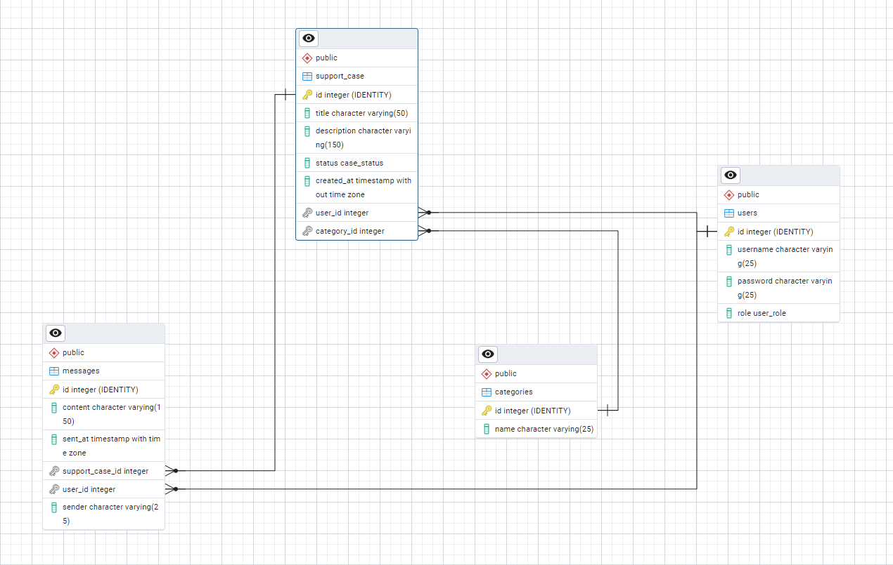

# SoporteApp

**Aplicación web de soporte para usuarios**, desarrollada en equipo utilizando tecnologías modernas como Vue 3 para el frontend y Go para el backend. El objetivo es ofrecer una plataforma sencilla y efectiva para la creación, gestión y seguimiento de casos de soporte.

---

---
##Usuarios y claves de prueba
- usuario1: 1234
- soporte1: 1234

---

## Descripción del proyecto

Esta aplicación permite a los usuarios autenticarse con usuario y contraseña para:

- Crear **casos de soporte** en distintas **categorías** (como "general", "facturación", "otros", etc.).
- Recibir respuestas por parte del **equipo de soporte** y del ususario mismo para añadir información.

El equipo de soporte, a su vez, puede:

- Ver todos los casos.
- Responder a cada uno mediante mensajes.

### Roles definidos

| Rol     | Permisos |
|---------|----------|
| Usuario | Crear casos, responder a sus propios casos |
| Soporte | Ver todos los casos, responder a todos los casos |

---

##  Tecnologías utilizadas

### Frontend (SPA)
-  Vue 3 + Vite
-  HTML5, CSS3, JavaScript (ES6+)
-  Pinia para manejo de estado
-  Axios para llamadas HTTP

### Backend (API REST)
-  Go
-  PostgreSQL como base de datos relacional

---

##  Modelo de datos (PostgreSQL)

[](ModeloBBDD)


> **Justificación de decisiones:**
[Diccionario del modelo de la base de datos](https://gitea.dev.loadfront.net/SamuelMoniz/Soporte-Tecnico-Diseno-Model/src/branch/main/Diccionario-de-datos.pdf)


---

## Diseño Web Estático (HTML, CSS, JS)

Antes de usar Vue, se desarrollaró un diseño web estático como primera etapa:

[Diseño web estático](https://gitea.dev.loadfront.net/SamuelMoniz/Soporte-Tecnico-Diseno-Model)

---

## 📂 Estructura del repositorio (resumen)

``` bash
support-app/
├── db/ # Base de datos
├── backend/ # API REST en Go
│ ├── main.go
│ ├── handlers/
│ ├── models/
│ └── db/
│
├── frontend/ # Frontend hecha en Vue 3
│ ├── public/
│ ├── src/
│ │ ├── assets/
│ │ ├── components/ # Componentes de la página
│ │ │    ├── ChatBox.vue
│ │ │    ├── ChatMessage.vue   
│ │ │    ├── Footer.vue   
│ │ │    ├── Header.vue   
│ │ │    ├── Report.vue   
│ │ │    └── Search.vue   
│ │ ├── views/ # Vistas hacen uso de componentes
│ │ │    ├── FormSupportCaseView.vue
│ │ │    ├── HomeView.vue   
│ │ │    ├── LoginView.vue   
│ │ │    ├── ReportList.vue   
│ │ │    └── ReponseSupportCaseView.vue   
│ │ ├── router/ 
│ │ │    └── index.js # Gestion de rutas
│ │ ├── store/
│ │ ├── App.vue
│ │ └── services/
│ ├── index.html
│ ├── index.html
│ └── vite.config.js
└── README.md # Este archivo
```

---

##  Estado actual del proyecto

- [x] Modelo de datos diseñado
- [x] Diseño estático de interfaz completado
- [x] Migración a Vue 3 en curso
- [ ] API en Go en desarrollo

## Autoría y colaboración

Este proyecto ha sido desarrollado de forma **colaborativa** por estudiantes del ciclo formativo de **Desarrollo de Aplicaciones Web (DAW)** como parte de una práctica formativa.


**Autores del proyecto:**
- [Danna Patricia](https://github.com/DannaPatricia)
- [Samuel Moniz Pereira](https://github.com/sam324sam)

---

